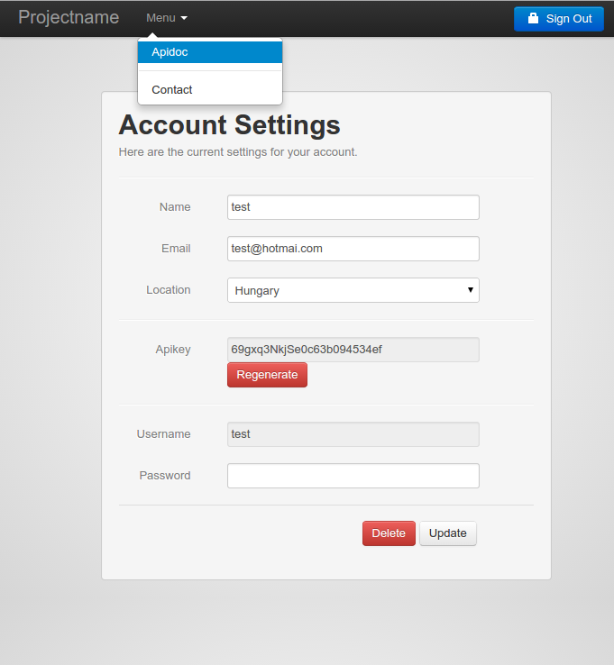

express-api-user-management-signup
==================================

Middleware for quickly building login systems on top of apis/express apps. This module adds a user facade-backend with login / registration on top of that. Good startingpoint for DIY api management, processable thru webhooks, themable using custom js/css/jade templates.

## WARNING: BETA, not production ready

#### login

#### login (basic theme)

#### logged in 

#### form generation using jsonschema

## Installation 

    npm install -g coffeescript 
    npm install jade express@3.0.6
    npm install express-api-user-management-signup

## Usage 

    var app, cfg, express, http, port, usermanagement, webhookhost, webhookport;
  
    express = require('express');
    http = require('http');
    require("coffee-script/register");
    usermanagement = require('./index.coffee');
  
    app = express();
    port = process.env.PORT || 3010;
    webhookport = process.env.WEBHOOK_HOST || port;
    webhookhost = process.env.WEBHOOK_HOST || 'http://127.0.0.1';
  
    cfg = {
      webhook: {
        url: 'http://' + webhookhost + ':' + webhookport,
        requestdata: {
          headers: {
            'x-some-token': 'l1kj2k323'
          }
        }
      },
      mongo: {
        host: 'localhost',
        port: 27017,
        name: 'foo'
      },
      layout: {
        theme: __dirname + '/app/public.account',    // define your own 
        // theme: __dirname + '/app/public.basic',   // templates
        title: {
          brand: 'Projectname',
          welcome: 'Please login to your account'
        },
        menu: {
          'Apidoc': {
            target: '_blank',
            url: '/api/v1/doc'
          },
          '---': '---',
          'Contact': {
            target: '_blank',
            url: 'mailto:support@foo.com'
          }
        },
        formurl: '/js/form.json'
      }
    };
  
    app.set('port', port);
    app.use(usermanagement(app, express, cfg));
    http.createServer(app).listen(app.get('port'), function() {
      console.log('Express server listening on port ' + app.get('port'));
    });

## Themes 

Define your own templates for easy integration with your js/css/html framework:

    cp -R node_modules/express-api-user-management-signup/app/public.basic mytheme

and in the config define    

    ...
      layout: {
        theme: __dirname + '/mytheme'
    ...

## Features:

* coffeescript yay!
* New User Account Creation
* Secure Password Reset via Email
* Ability to Update / Delete Account
* Session Tracking for Logged-In Users
* Local Cookie Storage for Returning Users
* Blowfish-based Scheme Password Encryption
* end-user webhooks
* optional internal webhooks for flexibilitystorage (to integrate with api proxy like apiaxle or emailgateway e.g.)
* logging of db actions
* apikey support + regeneration of apikey
* works standalone and as express drop-in lib (the latter needs improvement eg. app.use)
* flexible form using (optionally remote) jsonschema
* optional google analytics by passing environment variable GOOGLE_ANALYTICS_TOKEN=LK-2342LK

## Extend forms easily

By using [jsonform](https://github.com/joshfire/jsonform), we can easily extend the form without having to fiddle with database code.
Just have a look at :

* the '[form.json](https://github.com/coderofsalvation/express-api-user-management-signup/blob/master/app/public.account/js/form.json)' in this package
* the [docs](http://github.com/joshfire/jsonform/wiki).

> HINT: you can change the 'formurl'-parameter of 'app.[js,coffee]' (or the json above) into a remote url in order to remotely manage the form 

## Webhooks

The following webhooks are fired whenever these things occur:

* configuredhost + /add 
    when user adds account
* configuredhost + /update 
    when user updates account
* configuredhost + /update/pass 
    when user changes password
* configuredhost + /update/apikey
    when user regenerates apikey
* configuredhost + /login
    when user logs in
* configuredhost + /reset/pass
    when user resets password

Where configuredhost is defined by you in the config ('http://mygateway.com/foo' e.g.)
These webhooks can be reacted upon by other middle/software in order to 
 send emails or update api proxy settings e.g.

## Todo

* tests
* responsive ui (for smartphone etc)
* url validation for webhook url in jsonschema
* smaller fonts jsonform validation error tooltips (to match the layout)

## Built with

* [Node.js](http://nodejs.org/) - Application Server
* [Express.js](http://expressjs.com/) - Node.js Web Framework
* [MongoDb](http://www.mongodb.org/) - Database Storage
* [Jade](http://jade-lang.com/) - HTML Templating Engine
* [Stylus](http://learnboost.github.com/stylus/) - CSS Preprocessor
* [EmailJS](http://github.com/eleith/emailjs) - Node.js > SMTP Server Middleware
* [Moment.js](http://momentjs.com/) - Lightweight Date Library
* [Twitter Bootstrap](http://twitter.github.com/bootstrap/) - UI Component & Layout Library
* [jsonform](http://developer.joshfire.com/doc/dev/ref/jsonform)
* [underscore](http://documentcloud.github.com/underscore)
* [JSV](https://github.com/garycourt/JSV)
